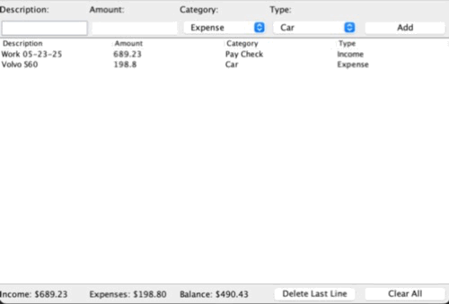
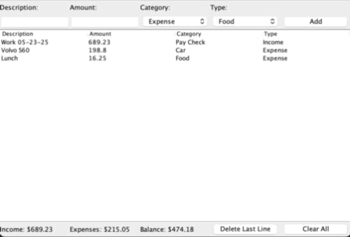

# FinanceTracker
A simple java app built with Swing that keeps track of users income and expenses.

---

##Features

-Add transactions by giving a description, dollar amount, category, and type.
-Remove the previous transaction.
-Clear all the transactions.
-Data is saved and loaded from a local file.

---

##Demos

### Adding  a Transaction

###Removing Previous or All Transactions

