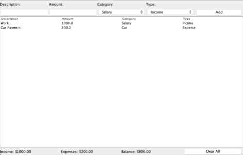
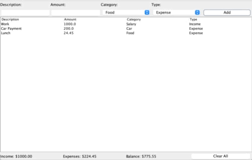

# FinanceTracker
Finance tracker java app that keeps track of income and expenses.

Transactions can be added by giving a breif description, the dollar amount, appropriate category, select wether it's income or expense, and then click "Add" button. All transactions are saved in a local text file.

There is a "Clear All" that clears the table and the local text file.

